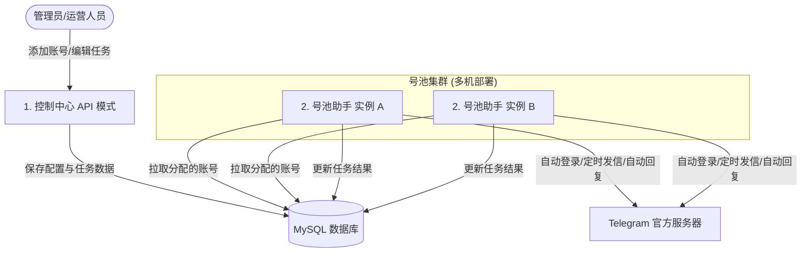

# Telegram 自动消息群发与回复系统

这是一个基于 Python 构建的 Telegram 消息自动化管理服务端。它可以帮助您统一管理多个 Telegram 账号，实现定时定量群发消息、自动识别新消息并进行智能回复，提供可视化的管理接口，并支持大规模多机器分布式运行。


---

## 💡 系统是怎么工作的？

本系统支持两种核心工作模式，它们各司其职，又通过同一个数据库紧密配合：



1. **控制中心 (API 模式)**：
   * 负责提供管理接口，供前端控制台或您的其他业务系统调用。
   * 您可以通过它：注册/登录管理员账号、通过短信验证码或 Session 文件导入 Telegram 账号、配置定时发送任务、设置关键字自动回复规则、以及上传图片/视频等媒体文件。
2. **号池助手 (号池模式)**：
   * 负责在后台默默干活。它会定期检查账号是否在线，并代表这些账号在特定时间向指定用户/群组发送消息。
   * 它还支持监听收到的新消息，并根据您配置的关键字规则自动回复，同时还会输出详细的运行健康状况。

---

## 🛠️ 快速本地启动

只需简单三步，即可在本地电脑将系统跑起来：

### 第一步：安装依赖环境

确保您的电脑安装了 Python 3.10+，然后在项目根目录下运行：
```bash
pip install -r requirements.txt
```

### 第二步：修改配置文件

1. 复制项目根目录下的配置文件模板：
   ```bash
   cp .env.example .env
   ```
2. 打开新创建的 `.env` 文件，填写您的数据库连接信息（`MYSQL_DSN`，注：由于 Alembic 迁移工具的同步性质，此处需配置同步格式链接，应用在异步运行时会自动将其转换为异步驱动连接，详情请参见 `.env.example`）以及 Telegram API 凭证（`TELEGRAM_API_ID` 和 `TELEGRAM_API_HASH`）。

### 第三步：启动系统

* **启动控制中心 (API 模式)**：
  ```bash
  python main.py
  ```
  *(启动后可访问控制台及 API 接口)*

* **启动号池助手 (号池模式)**：
  在环境变量中设置 `MODE=pool`，然后启动：
  ```bash
  python main.py
  ```

* **运行自动化测试**：
  ```bash
  python -m pytest -q
  ```

---

## 📚 完整的技术与运维文档导航

如果您需要了解更深入的系统架构、接口参数或线上部署运维，请点击以下链接阅读相关文档：

* 🚀 [部署调优与存储配置指南](file:///D:/DevelopOrgs/develop-order/telegram-auto-message-server/docs/DEPLOYMENT.zh-CN.md) —— 包含多机分片部署、Docker 部署配置、MySQL 数据库迁移、S3 文件存储清理策略以及号池参数性能调优。
* 🔌 [API 接口说明与使用示例](file:///D:/DevelopOrgs/develop-order/telegram-auto-message-server/docs/API-EXAMPLES.zh-CN.md) —— 列出所有可用的 HTTP 接口、请求响应示例以及快速联调清单。
* 📐 [系统架构与分层设计说明](file:///D:/DevelopOrgs/develop-order/telegram-auto-message-server/docs/ARCHITECTURE.zh-CN.md) —— 帮助开发者快速熟悉代码目录结构、分层逻辑、以及数据库表模型定义。
* 🚨 [运维排障与值班值守手册](file:///D:/DevelopOrgs/develop-order/telegram-auto-message-server/docs/OPERATIONS.zh-CN.md) —— 生产环境故障分级说明、降级告警处置、以及常见异常的应急处理。
* 📝 [运维值班速查表](file:///D:/DevelopOrgs/develop-order/telegram-auto-message-server/docs/ONCALL-CHEATSHEET.zh-CN.md) / [夜班极简速查表](file:///D:/DevelopOrgs/develop-order/telegram-auto-message-server/docs/ONCALL-NIGHT-SHORT.zh-CN.md) —— 方便值班人员在半夜或紧急情况下以最快速度定位和排除号池故障。
